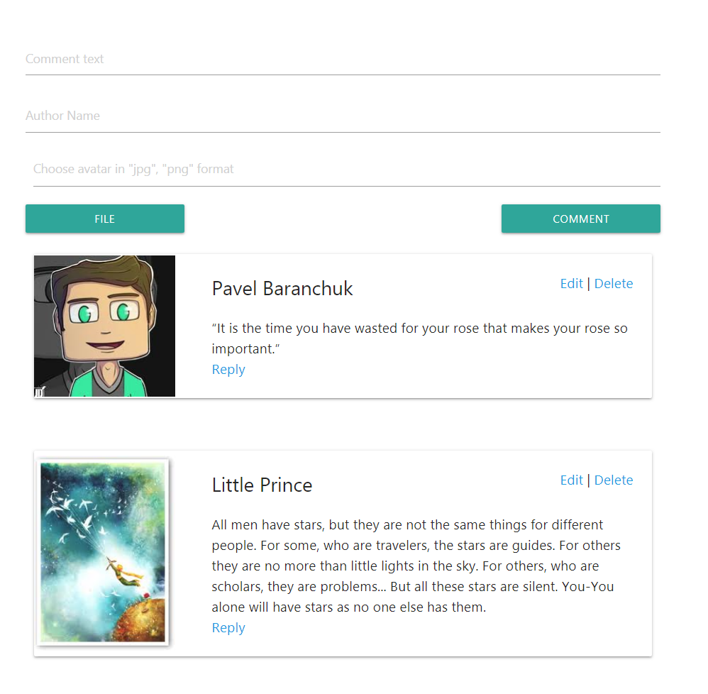

# 🖥 CRUD Application

Basic CRUD application that allows you to:
* Create a comment
* Edit comment
* Delete comment (You will need to confirm this action in a popup)
* You will be able to click the "Reply button" and create a reply to an existing message. This reply will be saved to a database but will not be shown on UI (will be implemented in a future releases)
* Scroll-to-the-top functionality was added for convenience
* Web app is responsive
* Empty field validation is built in
* You are allowed to choose avatars in "jpg" & "png" formats only (validated on client, server validation will be added soon)

## 📜 Summary


-   [🚀 Prerequisites](#-Prerequisites)
-   [🤖 Getting Started](#-Getting-Started)
-   [🚀 Built With](#-Built-With)

<br>

### Prerequisites

These instructions will get you a copy of the project up and running on your local machine. You would need the following software installed on your computer:

```
Node
MongoDB
```

### 🚀 Getting Started

Follow these steps to run the project:

* Clone and run the project

```
git cone https://github.com/pavelbaranchuk/crud_app.git
Run MongoDB
npm install
npm start
```
* Run the client in a separate command line

```
cd client_src
npm install
npm start
```

Here is the example of an application you can have 

<p align="center">
  
</p>

## Built With

* [React](https://reactjs.org/) - The web framework used
* [Loopback](https://loopback.io/) - The Node framework used
* [MongoDB](https://www.mongodb.com/) - Used to store the data

## Author

* **Pavel Baranchuk**
