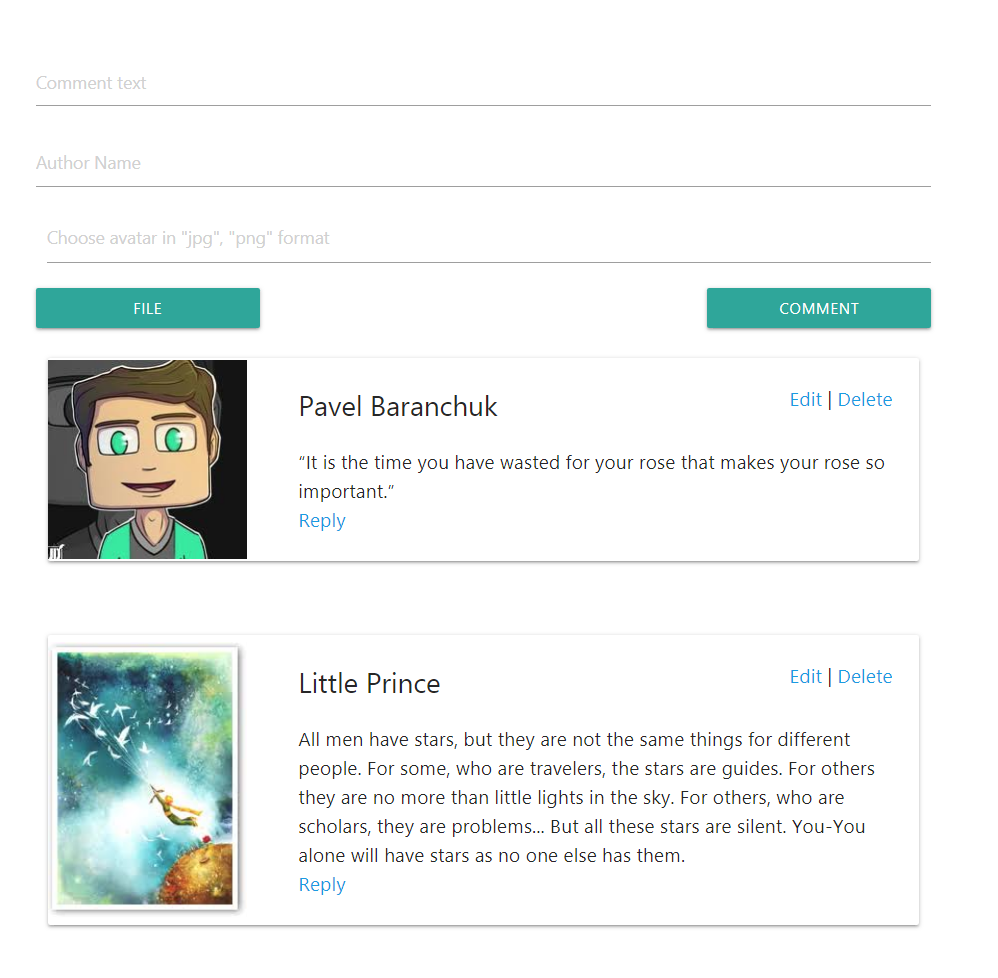

# CRUD Application

Basic CRUD application that allows you to:
* Create a comment
* Edit comment
* Delete comment (You will need to confirm this action in a popup)
* You wil be able to click the "Reply button" and create a reply to an existing message. This reply will be saved to a database but will not be shown on UI (will be implemented in a future releases)
* Scroll-to-the-top functionality was added for convenience
* Web app is responsive
* Empty field validation is built in
* You are allowed to choose avatars in "jpg" & "png" formats only (validated on client, server validation will be added soon)

## Getting Started

These instructions will get you a copy of the project up and running on your local machine.

### Prerequisites

You would need the following software installed on your computer

```
Node
MongoDB
```

### Installing

Follow these steps to run the project:

```
npm install
npm start (runnibg the server)
cd client_src
npm start (runnibg the client)

```

Here is the picture of an application that you will see 

<p align="center">
  
</p>

## Built With

* [React](https://reactjs.org/) - The web framework used
* [Loopback](https://loopback.io/) - The Node framework used
* [MongoDB](https://www.mongodb.com/) - Used to store the data

## Author

* **Pavel Baranchuk**
